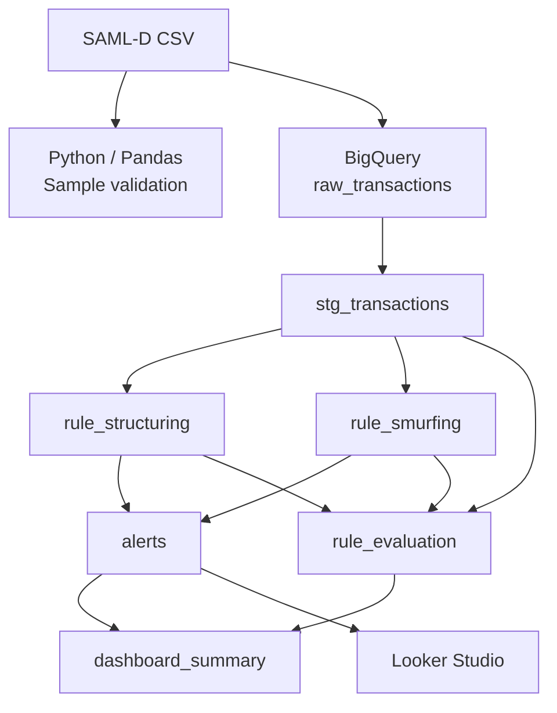

# AML Transaction Monitoring — SAML-D

MVP de ponta a ponta para monitoramento transacional AML/PLD, desenvolvido
com Python, BigQuery e Looker Studio sobre aproximadamente 9,5 milhões de
transações sintéticas do SAML-D.

Dashboards: 

O projeto implementa duas regras SQL explicáveis, avalia seu desempenho sem
target leakage e transforma os resultados em uma fila priorizada de alertas
para investigação humana.

A ideia era construir regras transparentes, que um analista de compliance pudesse revisar, explicar e auditar linha a linha. Usei Claude Code como apoio no desenvolvimento (revisão de queries, organização do repositório, documentação), Todas as consultas foram executadas no BigQuery, e os resultados, limiares e decisões finais foram revisados e validados por mim.

## Resultados

| Métrica | Structuring | Smurfing | Combinado |
|---|---:|---:|---:|
| Alertas agregados | 8.754 | 13.701 | **22.455** |
| Transações alertadas | 87.030 | 47.344 | **128.463** |
| True positives | 1.141 | 536 | **1.677** |
| False positives | 85.889 | 46.808 | **126.786** |
| False negatives | 8.732 | 9.337 | **8.196** |
| Precision | 1,3110% | 1,1321% | **1,3054%** |
| Recall | 11,5568% | 5,4289% | **16,9857%** |
| F1-score | 2,3549% | 1,8736% | **2,4245%** |
| Alert rate | 0,9156% | 0,4981% | **1,3516%** |
| Precision lift | 12,62x | 10,90x | **12,57x** |

Lendo os números: a base completa tem prevalência de lavagem de 0,10%. As duas regras juntas reduzem o universo de investigação para 1,35% das transações e capturam 17% dos casos ilícitos, com precision de 1,3% na fila, uma concentração 12,6 vezes maior do que revisar transações ao acaso.

A precision baixa em termos absolutos é esperada para regras determinísticas de primeira linha em AML. O papel delas não é decidir que houve lavagem, e sim priorizar a fila que vai para investigação humana. Ainda assim, o volume de falsos positivos está listado nas limitações porque há caminhos claros para reduzi-lo (ver "Próximos passos").

## Arquitetura



O notebook Python (`notebooks/01_data_intake_and_sample_validation.ipynb`) roda antes de tudo, sobre as primeiras 10.000 linhas do CSV. Ele existe para validar esquema e tipagem — contas preservadas como string, construção do `Transaction_timestamp`, checagem de nulos na conversão de data/hora e antes de subir 9,5 milhões de linhas para o BigQuery. Como as primeiras 10 mil linhas não são amostra aleatória, nenhuma estatística final vem dele; tudo que está na tabela acima foi calculado no BigQuery sobre a base completa.

## As regras

### Structuring

Procura uma conta que recebe, na mesma semana e na mesma moeda, valores fragmentados vindos de vários remetentes: pelo menos 3 transações de pelo menos 3 remetentes distintos, somando 10.000 ou mais no total, mas sem nenhuma operação individual acima de 10.000. O limiar de 10.000 espelha o padrão clássico de fracionamento para ficar abaixo de valores de reporte obrigatório — o comportamento que a tipologia de structuring descreve.

Chave de agrupamento: `receiver_account` + semana + `payment_currency`.

### Smurfing

Aqui o foco muda do destinatário para o **par** remetente–destinatário. A regra busca fluxos pequenos e recorrentes entre as mesmas duas contas ao longo da semana:

- entre 3 e 8 transações, com atividade em pelo menos 3 dias distintos e duração mínima de 48 horas (para filtrar rajadas de pagamentos legítimos em um único dia);
- valor total entre 6.000 e 25.000, ticket médio de até 4.000 e nenhuma transação individual acima de 5.000.

Chave de agrupamento: `sender_account` + `receiver_account` + semana + `payment_currency`.

### Target leakage

O dataset traz as colunas `is_laundering` e `transaction_pattern`, que são a resposta correta. Elas ficam fora de toda a camada de regras e só entram depois, em `rule_evaluation`, para medir precision e recall. Se entrassem antes, as métricas ficariam artificialmente perfeitas e o pipeline seria inútil como demonstração.

## Estrutura do repositório

```text
aml-transaction-monitoring-saml-d/
├── README.md
├── CLAUDE.md
├── notebooks/
│   └── 01_data_intake_and_sample_validation.ipynb
├── sql/
│   ├── 01_staging_view.sql
│   ├── 02_rule_structuring.sql
│   ├── 03_rule_smurfing.sql
│   ├── 04_alerts_view.sql
│   ├── 05_rule_evaluation.sql
│   └── 06_dashboard_summary.sql
├── docs/
│   ├── GUIA_REPRODUCAO_PTBR.md
│   └── DICIONARIO_DE_DADOS.md
└── dashboard/
    ├── aml_dashboard.png
    └── aml_transaction_monitoring_dashboard.pdf
```

## Reprodução

1. Rode o notebook para conferir a estrutura do CSV.
2. Carregue o dataset no BigQuery e crie `raw_transactions`.
3. Execute os SQLs na ordem numérica (`01` a `06`).
4. Conecte o Looker Studio às tabelas `aml_monitoring.dashboard_summary` e `aml_monitoring.alerts`.

Nos cards consolidados do dashboard, use o filtro `rule_name = ALL_RULES` com agregação `MAX`. Os valores esperados são os da tabela de resultados acima (9.504.852 transações, 9.873 ilícitas, 22.455 alertas).

Instruções detalhadas estão em `docs/GUIA_REPRODUCAO_PTBR.md`.

## Limitações

O dataset não tem conversão de moedas. Por isso, as regras analisam cada moeda separadamente. Mesmo assim, os mesmos limites são usados para moedas diferentes, o que precisaria ser ajustado em um sistema real. 

## Próximos passos

Em ordem de impacto provável sobre a precision: baseline comportamental por conta, normalização cambial e parametrização dos limiares para permitir tuning sistemático. Depois disso, análise de rede transacional (detecção de hubs e cadeias), execução agendada com alertas automáticos e testes de qualidade de dados no pipeline. Um uso interessante de IA generativa aqui seria resumir os casos já alertados para o analista — nunca decidir o alerta.
